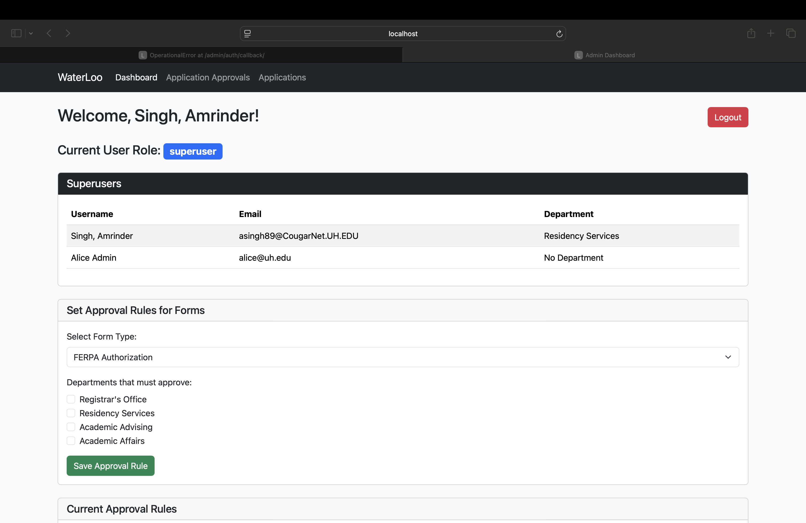
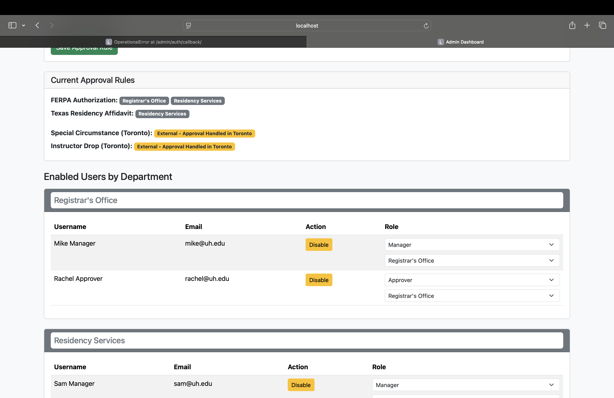
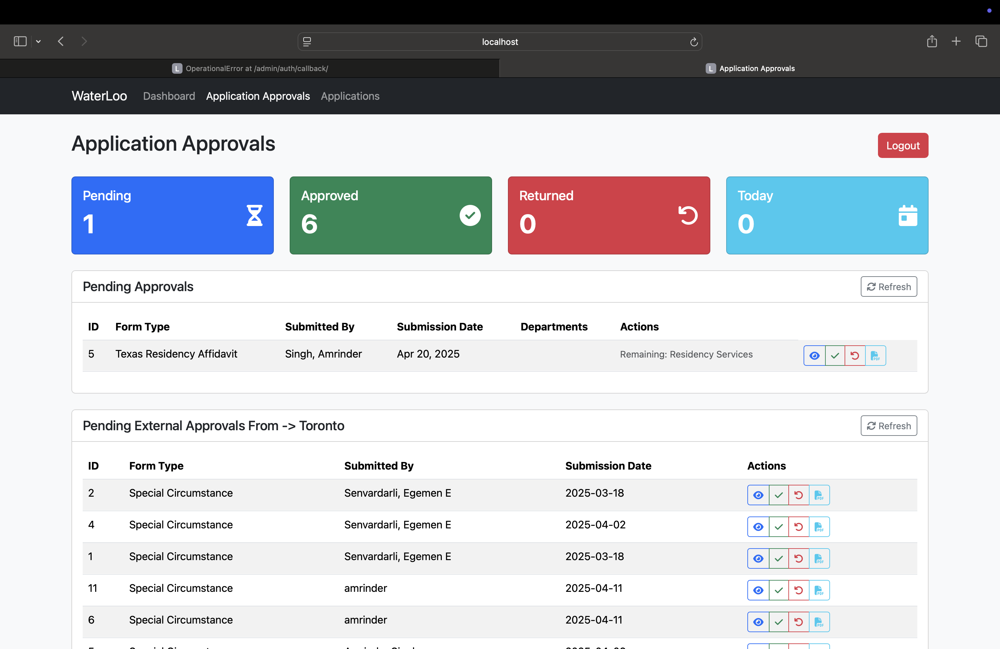
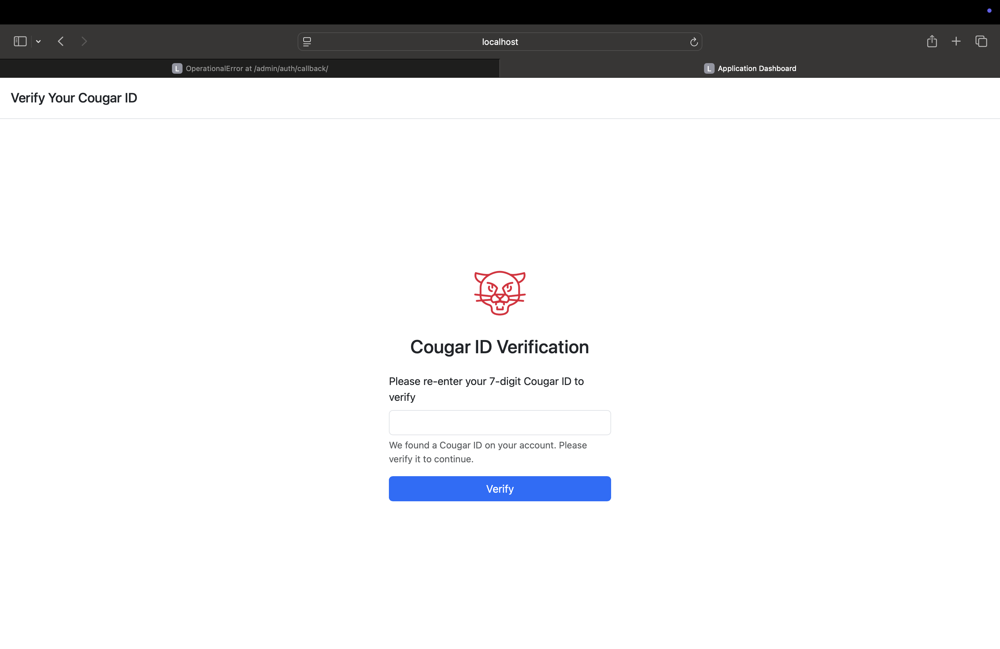
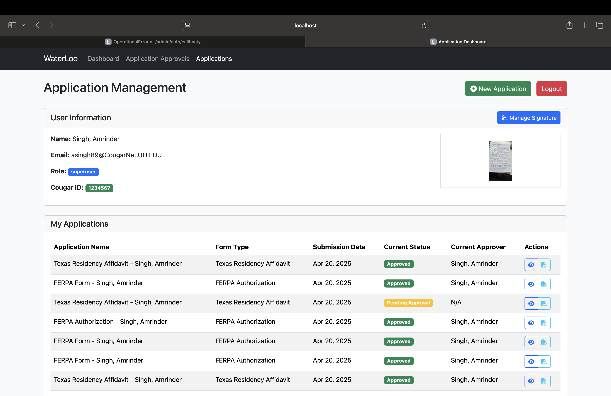
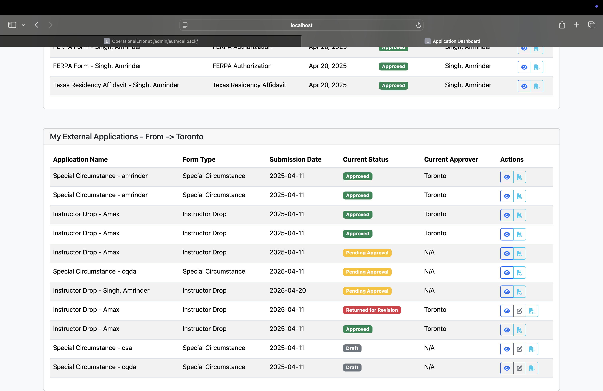

# COSC-4353-Group-Project - v4

## 🚀 To Run

Just run each Docker file from the `waterloo` and `toronto` folders.

Then open:

👉 [http://localhost:8000/admin/login/](http://localhost:8000/admin/login/)

---

## 📸 Screenshots

### 1

### 2

### 3

### 4

### 5

### 6

