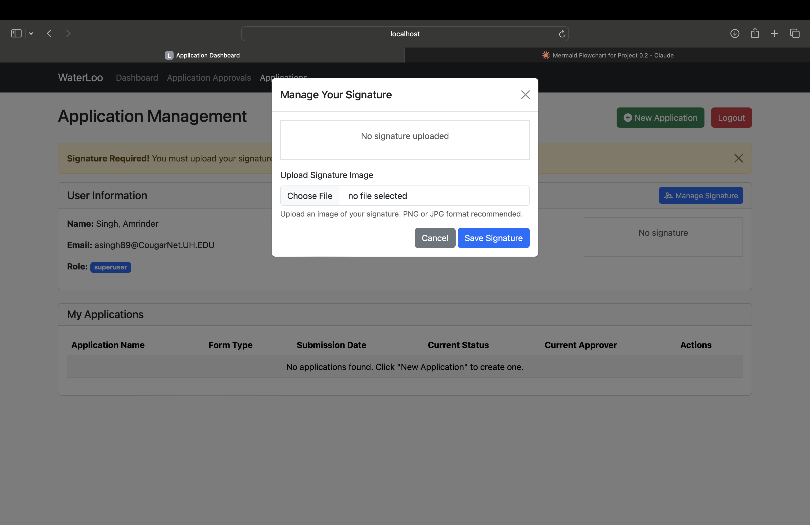
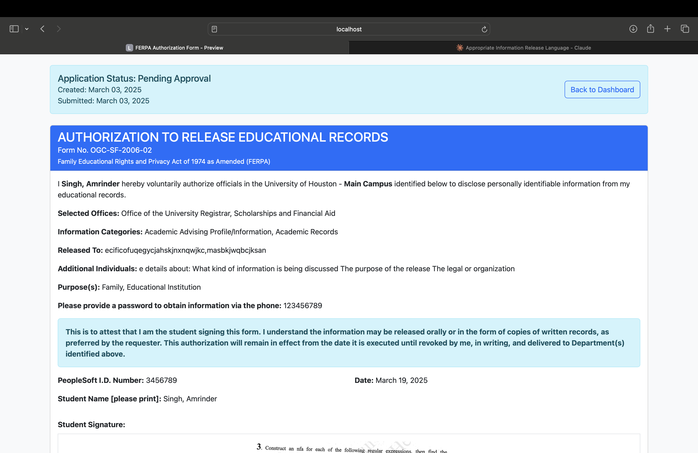
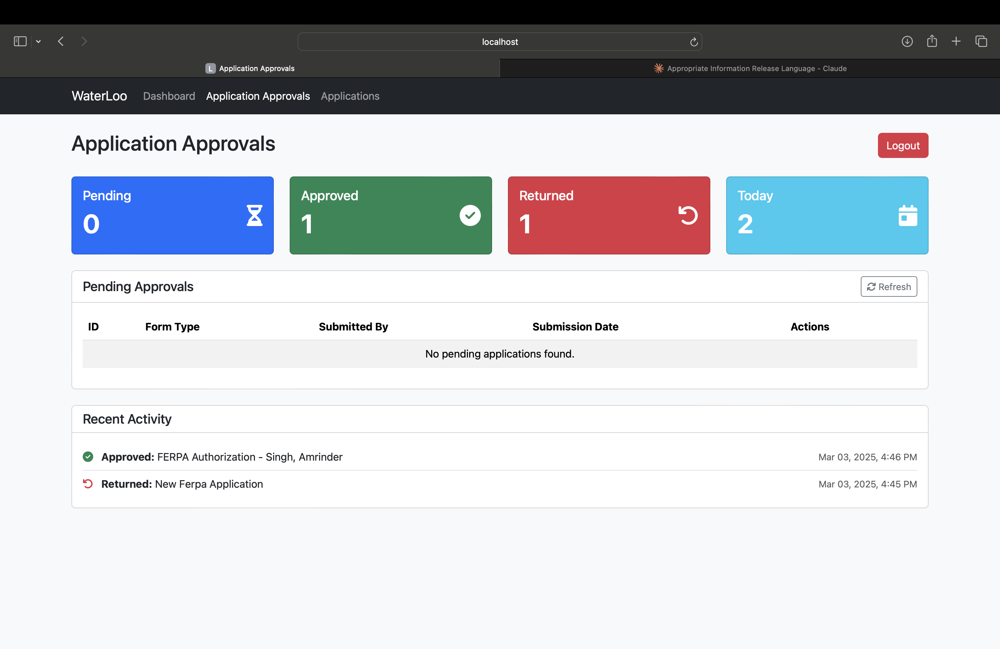

# COSC-4353-Group-Project
Welcome to the official repository for Team Waterloo's project!

## Project Overview
This project is a **user management system**

### ER MODEL FOR DATABASE

## Screenshots

### Screenshot 1

- This is the **Login Page** where users are prompted to log in with Microsoft.
- The system uses Azure for authentication, which then opens the Microsoft portal for secure sign-in.

### Screenshot 2

- Here, the Microsoft portal is displayed.
- Users input their credentials to authenticate via Microsoft’s secure OAuth system.

### Screenshot 3

- After authentication, users are redirected to the **Dashboard**.
- In this view, **superusers** and **managers** can manage user roles, disable users, and promote user levels.

### Screenshot 4

- This is the **Selected Applications** section accessed from the navigation bar.
- Users can submit applications here; however, they must first upload a signature image.
- Without uploading a signature, users cannot proceed with their application.

### Screenshot 5

- This screen displays the user’s signature.
- A quotation placeholder was used during testing, but it shows how the uploaded signature will appear in the system.

### Screenshot 6

- In this step, users choose which application form they wish to apply for.

### Screenshot 7

- After selecting a form, the system opens the application form.
- The user’s name is automatically pulled from the database, and the user fills in the remaining details.

### Screenshot 8

- This view shows an image pulled from the user table in the database.
- Users are given two options: **Submit** the application or **Save as Draft**.

### Screenshot 9

- Once the application is successfully submitted, it appears in the **My Application** section.
- Details include statuses such as **Pending**, **Returned**, **Approved**, or **Draft**.
- Additional actions include an eye button for viewing and a PDF icon for downloading the application.

### Screenshot 10

- This is the **Application Approvals** section from the navigation bar.
- Accessible only to superusers and managers, this view allows for application approval, return, viewing, and PDF downloads.

### Screenshot 11

- When an application is returned, this screen allows the user to send a message back, explaining why it was returned.

### Screenshot 12

- This screen is dedicated to **Viewing an Application** in detail.

### Screenshot 13

- This view shows both approved and disapproved applications.
- It also displays recent activity along with key metrics at the top: total applications for today, and counts of pending, approved, and returned applications.

### Screenshot 14

- Back in the **My Application** section, this screen shows the approved and returned applications.
- Returned applications include an **Edit and Resubmit** button for further action.