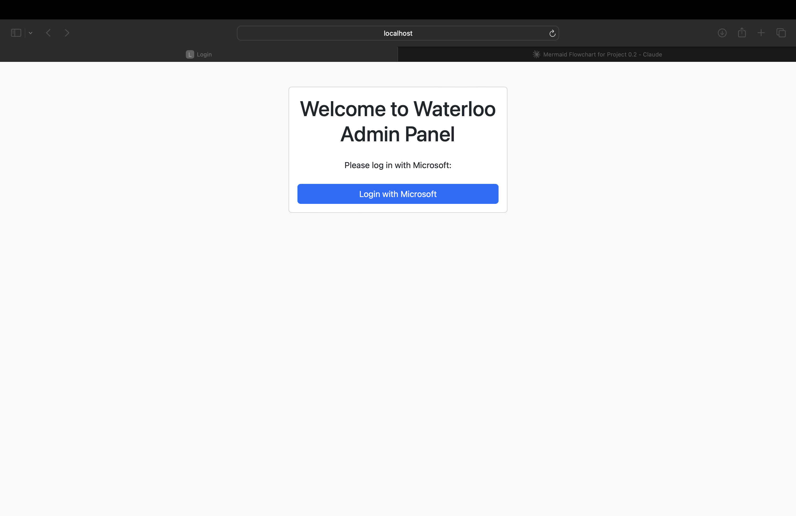

# COSC-4353-Group-Project
Welcome to the official repository for Team Waterloo's project!

## Project Overview
This project is a **user management system**

## Screenshots

Here are some screenshots of the project:

### Screenshot 1

- This is the **Login Page** where users initiate authentication.
- Users must click the **"Login with Microsoft"** button.
- Clicking this button redirects users to **Microsoft's authentication system** for secure login.

### Screenshot 2

- After clicking **"Login with Microsoft,"** users are taken to **Microsoft’s authentication page**.
- Users must choose which Microsoft account they want to log in with.
- This step ensures secure and authorized access using OAuth authentication.

### Screenshot 3

- Once authentication is successful, Microsoft redirects the user to the **Admin Dashboard**.
- The **superuser** has control over user management.
- Superusers can:
  - Disable users.
  - Assign roles such as **Superuser, Manager, or Common User**.
- This dashboard provides complete control over user access and permissions.
